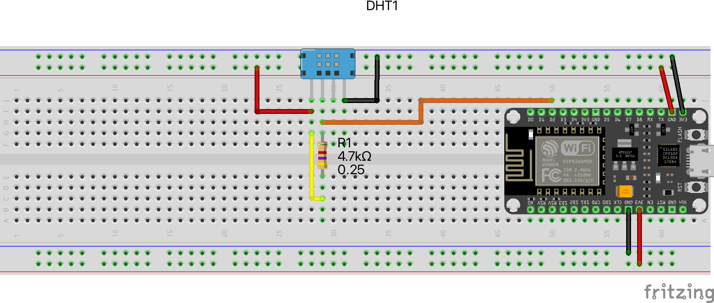
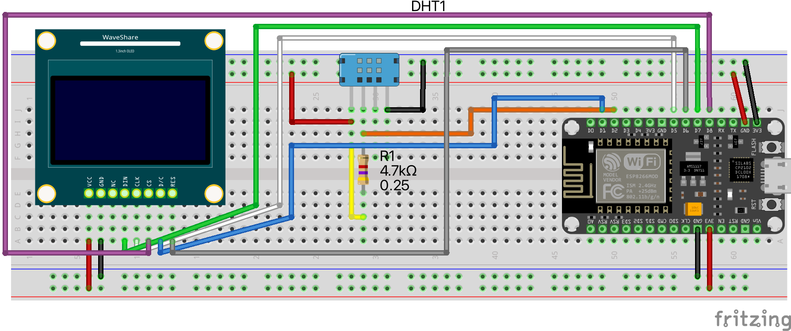

# ESP8266 Temperatur und Feutigkeitsmessung

## Installation
- Arduino IDE
- ESP8266 Platform im Boardmanager hinzufügen
- DHT Sensor Library by Adafruit im Bibliotheksmanager hinzufügen

## Temperatur und Feutigkeit messen

### BoM Aufgabe 1
- ESP8266
- DHT Sensor
- Widerstand 4.7 kOhm
- 6 Jumperkabel
- 1 x Breadboard

### Aufgabe 1

Die Luftfeuchtigkeit und die Temperatur soll in der seriellen Konsole ausgegeben werden.

#### Schaltung

### BoM Aufgabe 2
- alles aus Aufgabe 1
- 0.96" OLED SPI/I2C
- 7 Jumperkabel

### Aufgabe 2
Jeder einzelen Wert soll im wechsel auf dem OLED angezeigt werden, dabei soll die Maßeiheit und eine Bezeichung angezeigt werden.

Beispiel:

Temperatur
23 Grad

Luftfeutigkeit
40 %

#### Schaltung

### Zusatz

- Zeige die gemessene Temperatur zentriert auf dem OLED
- Lass die gemessene Luftfeutigkeit horizontal durch das OLED laufen
- In der Beispielimplementierung war der Fehlerteufel am Werk, finde die Fehler und überarbeite den Code